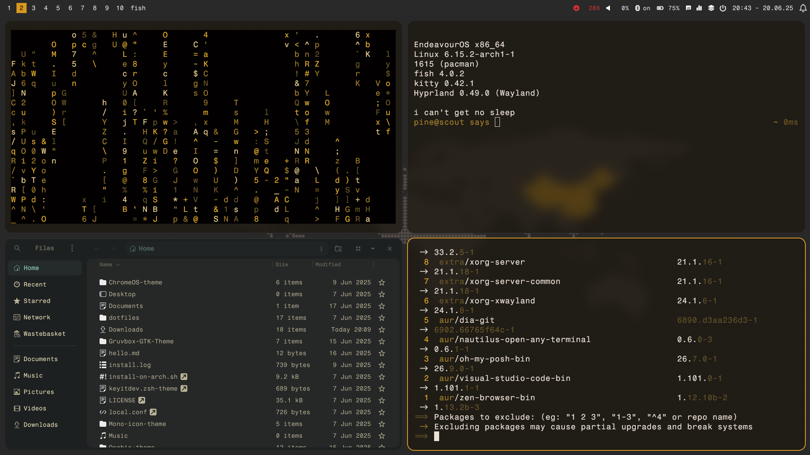

# dots
Based on https://github.com/mylinuxforwork/dotfiles.

## Warning, these dotfiles only work on Arch based distros.

## What you're in for

### How to install
Use a pacman wrapper, for this we will be using **yay**.
Open a terminal, and paste:

`yay -S hyprland hyprlock hypridle waypaper nwg-dock-hyprland nwg-displays fish googledot-cursor-theme nautillus zen-browser-bin grim grimblast-git cliphist vim wlogout cmatrix cava ttf-jetbrains-mono-nerd nwg-look qt6ct ttf-fragment-mono ttf-fontawesome rofi-wayland pywal kitty waybar papirus-icon-theme waypaper hyprpaper git`

Once installed, type these commands:
*Backup your current config*

`cp -r ~/.config/hypr ~/.config/hypr.old`

*Delete current config (don't worry, it's all safe in the backup)*

`rm -rf ~/.config/hypr`

*Clone this repository*

`git clone https://gitlab.com/goldermanch88/dotfiles.git`

Once done, open up a file manager (Like, Nautillus, under the pseudonym "Files", the manager you just installed) and start dragging and dropping the files.